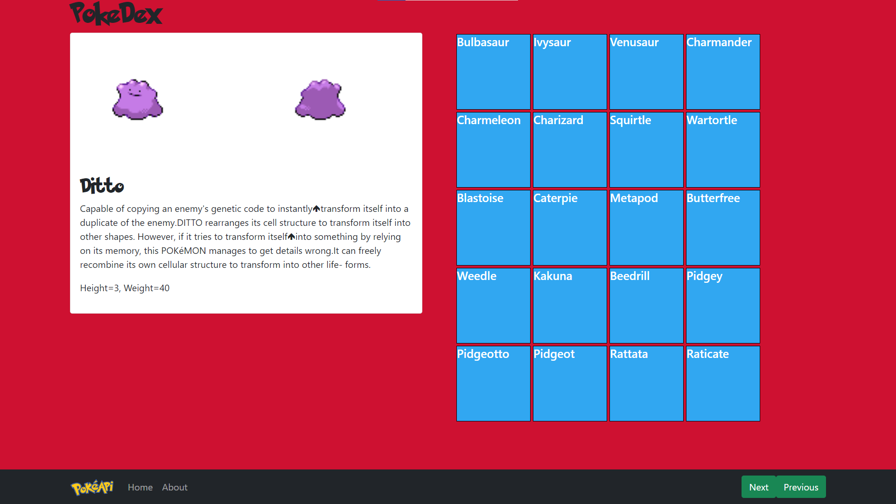

# PokeDex 

I built this App to as a fun project with React JS.
the data is powered from PokeAPI 'thank you for the free use!' hope you have fun using the app
and thank you for taking intrest in how it's made

you can <a href="https://monster-dex.herokuapp.com/" target="_blank"><b>Play</b></a> the Game here

## Welcome to PokeDex

PokeDex is hosted thru heroku, please
check it out

**Known issues**
May not collect all resources before attempting to mount. 
> If all you see is red screen click refresh button. This is what you should see once up.

(<a href="#readme-top">back to top</a>)

